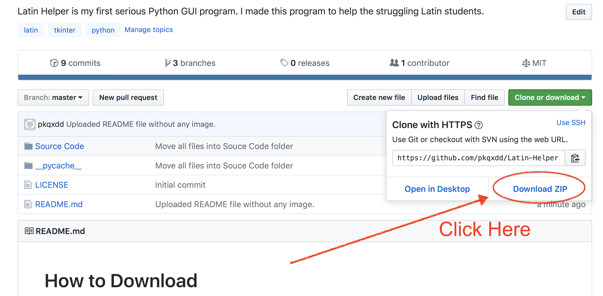
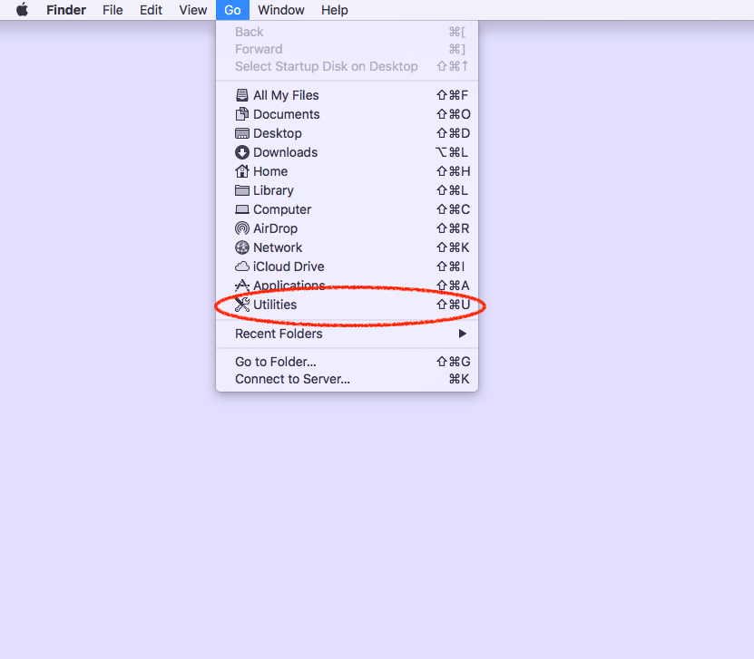
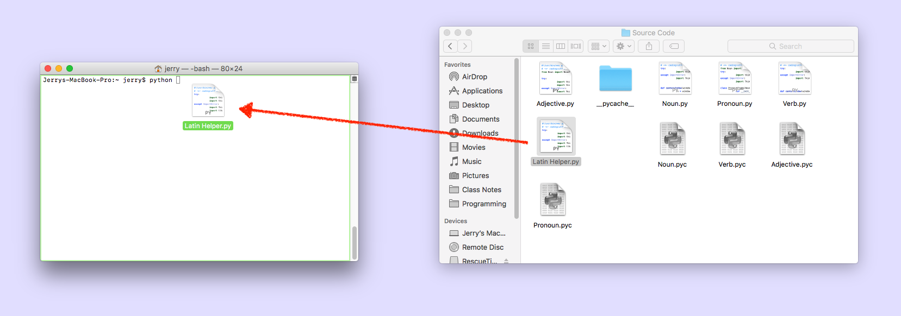
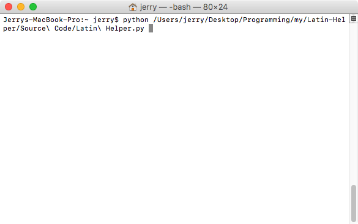

# Introduction
Hi! I am Ruocheng Wang, a currently Latin 1 student. This is the first serious Python GUI program I made. This program is meant to help Latin students with their classwork. However, before you use it, please make sure you are not violating your school's honor code. 

I have to say that although I made the algorithm in the program as accurate as possible, restricted by my poor knowledge, the output may still be inaccurate, especially for adjective part. This program has no dictionary inside, nor does it connect to any online dictionary. The output solely relies on your input. It is merely a simulation of what you would do, say, when you try to conjugate a verb. Also, please don't put in irregular conjugation and declension word inside, such as *eo, ire, ivi, itum* or *multus, multa, mumltum*, it is almost gurenteed you will get wierd results. 

Note that the maximum window height of verb part is 1179 pixels, and 1192 pixels for adjective part. This means that if your screen resolution is not high enough (e.g. 1920x1080), don't select everything when you are generating the answer. 
# How to Download 
Click on the green button at top-right corner, then select download zip.

# How to Run Source File
Sometimes, the application can have all kinds of weird problems. In this case, it is better to run the source code directly. The following steps are written for macOS, as `Python` is pre-installed on every mac.
1. Open the Terminal.app, which is located in /Application/Utilities folder.

2. Type `python ` (there is a space after it) in terminal, then drag the file `Latin Helper.py` located in the `source` folder to the Terminal window. 

3. Press `enter`.

Note: In this case, the program is attached to the terminal. To terminate the program, simply close the terminal winow. 