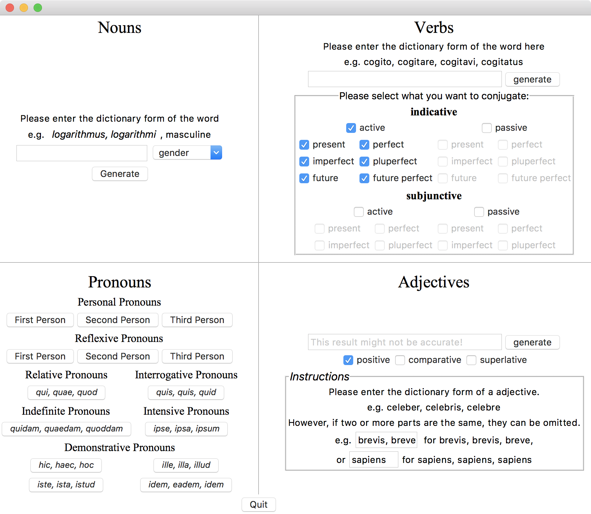

#### UPDATE Apr. 18, 2017: Minor release 0.2.3 (Bugs Fix) 
#### UPDATE Apr. 14, 2017: Windows and Mac Version is now online.
Thanks Henry Yong's for his contribution to this software.
# Software Screenshot

# Introduction
This is the first serious Python GUI program I made. This program is meant to help Latin students with their classwork. However, before you use it, please make sure you are not violating your school's honor code. 

I have to say that although I made the algorithm in the program as accurate as possible, restricted by my poor knowledge, the output may still be inaccurate, especially for adjective part. This program has no dictionary inside, nor does it connect to any online dictionary. The output solely relies on your input. It is merely a simulation of what you would do, say, when you try to conjugate a verb. Also, please don't put in irregular conjugation and declension word inside, such as *eo, ire, ivi, itum* or *multus, multa, mumltum*, it is almost gurenteed you will get wierd results. 

Note that the maximum window height of verb part is 1179 pixels, and 1192 pixels for adjective part. This means that if your screen resolution is not high enough (e.g. 1920x1080), don't select everything when you are generating the answer. 

## Running the program

```sh
python source/Latin\ Helper.py
```

